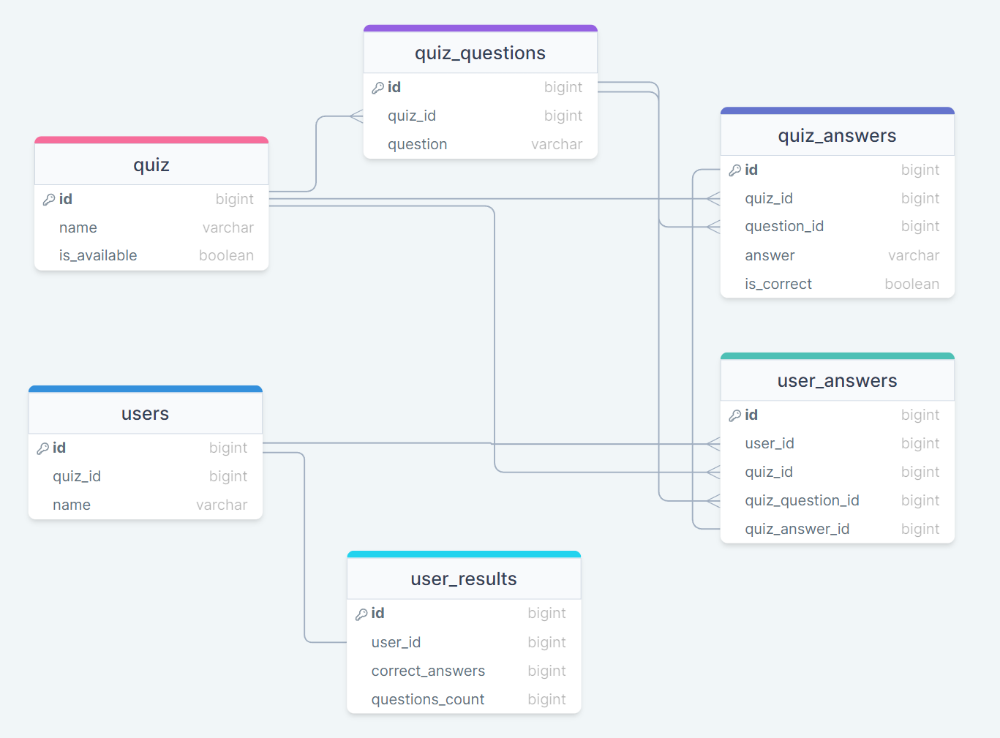

# REQUIREMENTS

The minimum requirement for this project: **your web server supports PHP 8.1**.

# LIBRARIES USED IN THE PROJECT
- [FastRoute](https://github.com/nikic/FastRoute) - routing
- [Doctrine-DBAL](https://www.doctrine-project.org/projects/doctrine-dbal/en/latest/reference/introduction.html#introduction) - accessing the database
- [Phoenix](https://github.com/lulco/phoenix) - database migrations
- [PHPUnit](https://phpunit.de/) - testing
- [Twig](https://twig.symfony.com/doc/3.x/) - template engine for PHP
- [PHP-DI](https://github.com/PHP-DI/PHP-DI) - dependency injection container

# DATABASE ARCHITECTURE
Project has the following database architecture:


# INSTALLATION
Follow the installation instructions below.

### 1. Download project

`git clone https://github.com/BaibaNi/PrintfulQuiz.git`

### 2. Install Composer Dependencies

`composer install`

- If you do not have [Composer](https://getcomposer.org/), you may install it by following the instructions at [getcomposer.org](https://getcomposer.org/doc/00-intro.md#installation-nix).

### 3. Project configuration
- Create your local database.
- Copy `config/configuration-dist.php` file into project's root directory, rename it to `configuration.php` and edit the file with real data, for example:
```php
return [
    'db' => [
        'db_name'     => 'my_db', // add your database name
        'db_user'     => 'user',  // add your username
        'db_password' => 'pass',  // add your password
        'db_host'     => 'localhost',
        'db_driver'   => 'pdo_mysql',
    ]
];
```

### 4. Project's database tables migration configuration
- Copy `config/phoenix-dist.php` file into project's root directory, rename it to `phoenix.php` and edit the file with real data, for example:
```php
return [
    'migration_dirs' => [
        'first' => __DIR__ . '/db/migrations', // database migrations for project
        'tests' => __DIR__ . '/db/tests', // database migrations for tests
    ],
    'environments' => [
        'local' => [
            'db_name'   => 'my_db', // add your database name
            'username'  => 'user',  // add your username
            'password'  => 'pass',  // add your password
            'host'      => 'localhost',
            'adapter'   => 'mysql',
            'port'      => 3306,
            'charset'   => 'utf8mb4',
            'collation' => 'utf8mb4_general_ci',
        ]
    ],
    'default_environment' => 'local', 
    'log_table_name' => 'phoenix_log',
];
```

### 5. Run the project
- Start your local server

### 6. Migrate database tables
- When the `default_environment` is set and local server fully operating, run `php vendor/bin/phoenix migrate` command to migrate necessary tables to database. (You can also use the database dump file `db/db_printful_dump.sql`.)
- Other useful commands:
    - create migration `php vendor/bin/phoenix create <migration> [<dir>]` (e.g. `php vendor/bin/phoenix create "migrations\QuizTable" first`, or `php vendor/bin/phoenix create "tests\TestQuizTable" tests` for test database)
    - migrate db `php vendor/bin/phoenix migrate`
    - rollback migrations `php vendor/bin/phoenix rollback`
- [Phoenix documentation](https://github.com/lulco/phoenix)

### 7. Start using application

# TESTING
[PHPUnit](https://phpunit.de/) is used for testing.
To start  test cases, run the following commands:
- make sure that autoloading is in place, if necessary, run following command: `composer dump-autoload`
- for unit tests run `./vendor/bin/phpunit tests/unit`
- for all test suite run `./vendor/bin/phpunit tests`
